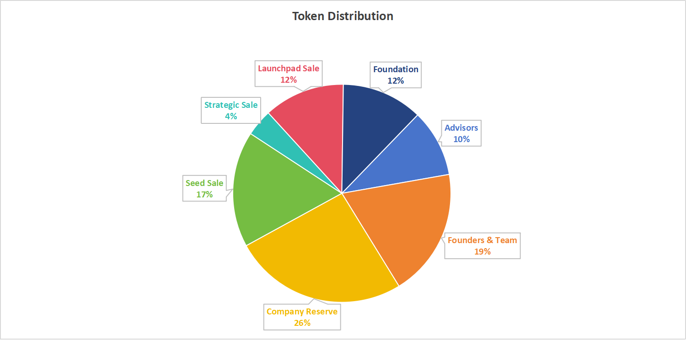

# Revenue Sharing

In xPet.Tech, the Revenue Sharing system is a fundamental mechanism that ensures the community benefits from the platform's success. Here's how it works:

<figure><figcaption>
TIGER token distribution
</figcaption></figure>

* **Project's Share of Revenue:**

To support the ongoing development and enhancement of the platform, 19% of the total revenue generated is allocated to the Tiger Killer founders and team. This portion is allocated for the continuous improvement and expansion of the platform's offerings.

* **TIGER Fund for Community Growth:**

We will leave 12% aside for marketing purposes, rewarding users through special events, or events that help grow users.
