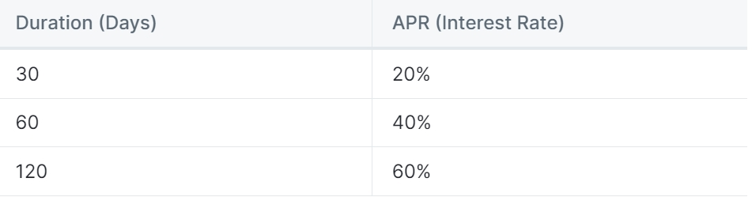

# Staking

Staking in Tiger Killer is a powerful mechanism that allows users to put their TIGER tokens to work and earn additional TIGER interest.

**Stake TIGER Tokens:**

Staking involves the process of locking in a certain amount of TIGER tokens. This action signifies your commitment to holding and growing your TIGER holdings over a specific period.

**Earning TIGER Interest:**

By staking your TIGER tokens, you become eligible to earn TIGER interest. This means that you'll receive additional TIGER tokens as a reward for holding onto your existing TIGER assets.

**Duration and Interest Rates:**

The duration for which you choose to stake your TIGER tokens directly impacts the interest rates you'll receive. Specifically, staking periods of 30, 60, and 120 days correspond to Annual Percentage Rates (APRs) of 20%, 40%, and 60%, respectively.

<figure><figcaption>
APR with different Durations.
</figcaption></figure>

Opting for longer staking periods offers higher APRs, providing users with an incentive to commit to holding their TIGER tokens for extended durations.

**Flexibility in Staking Durations:**

Users have the flexibility to choose the staking duration that aligns best with their preferences and investment strategy. Whether it's a short-term commitment or a longer-term approach, Tiger Killer accommodates various timeframes.

#### NFT staking

Tiger Killer’s team is working on a staking solution for endangered species character NFTs.

Staking in Tiger Killer is a strategic way to maximize the potential growth of your TIGER holdings. By staking for specific durations, you're able to earn TIGER interest at competitive rates. This feature empowers users to actively participate in the growth of their TIGER assets and enhance their overall experience within the Tiger Killer ecosystem.
