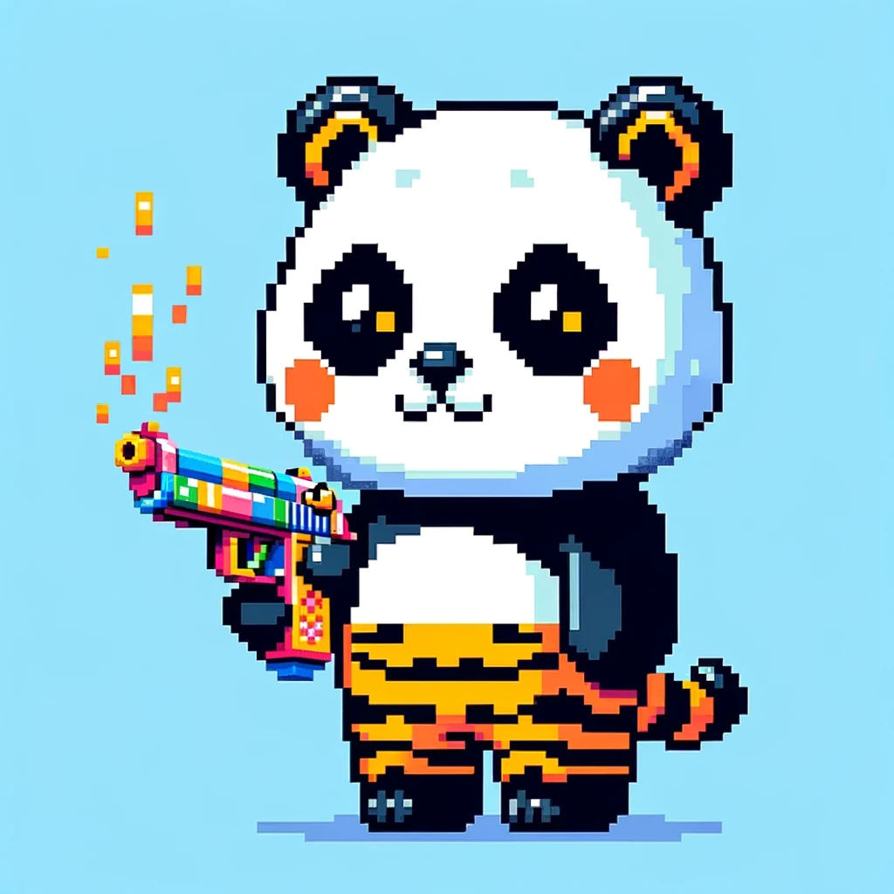

# Buy the NFT roles

Here are some examples:

<figure><figcaption>
Panda
</figcaption></figure>

<figure><figcaption>
Picture of Giant Panda
</figcaption></figure>

The giant panda, sometimes called a panda bear or simply panda, is a bear species endemic to China. It is characterised by its bold black-and-white coat and rotund body.  In 2016, it was reclassified on the IUCN Red List from "endangered" to "vulnerable", affirming decade-long efforts to save the panda. In July 2021, Chinese authorities also reclassified the giant panda as vulnerable.

<figure><figcaption>
Mountain Gorilla
</figcaption></figure>

<figure><figcaption>
Picture of Mountain Gorilla
</figcaption></figure>

The mountain gorilla is one of the two subspecies of the eastern gorilla. It is listed as endangered by the IUCN as of 2018. As of June 2018, there were more than 1,000 individuals.

These are some endangered animal characters with a gun who wears a tiger stripe cloth. We want to use endangered animals as our characters because we want players to know more about endangered animals and raise their awareness.

In addition, each animal wears tiger-stripe clothes to show our theme of the tiger. The player behind each animal image represents an animal hunter. They hunt Sumatran tigers to obtain tiger skins, which are the tiger-striped clothes worn by the above rare animals. Letting endangered animals wear tiger skins shows a kind of ridicule, which mocks those hunters who are killing animals in the name of protecting animals, and also mocks those hunters who ignore endangered species and only consider their own interests.
