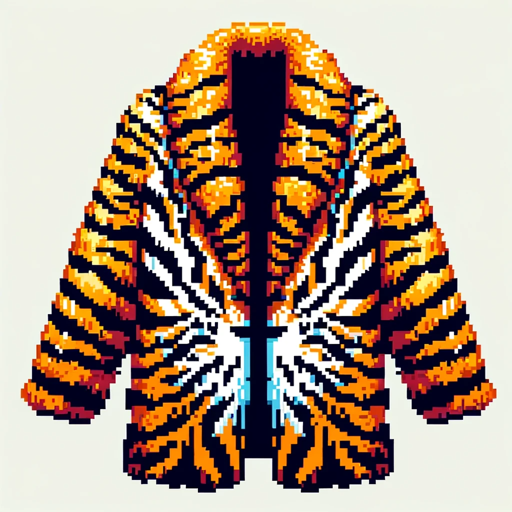
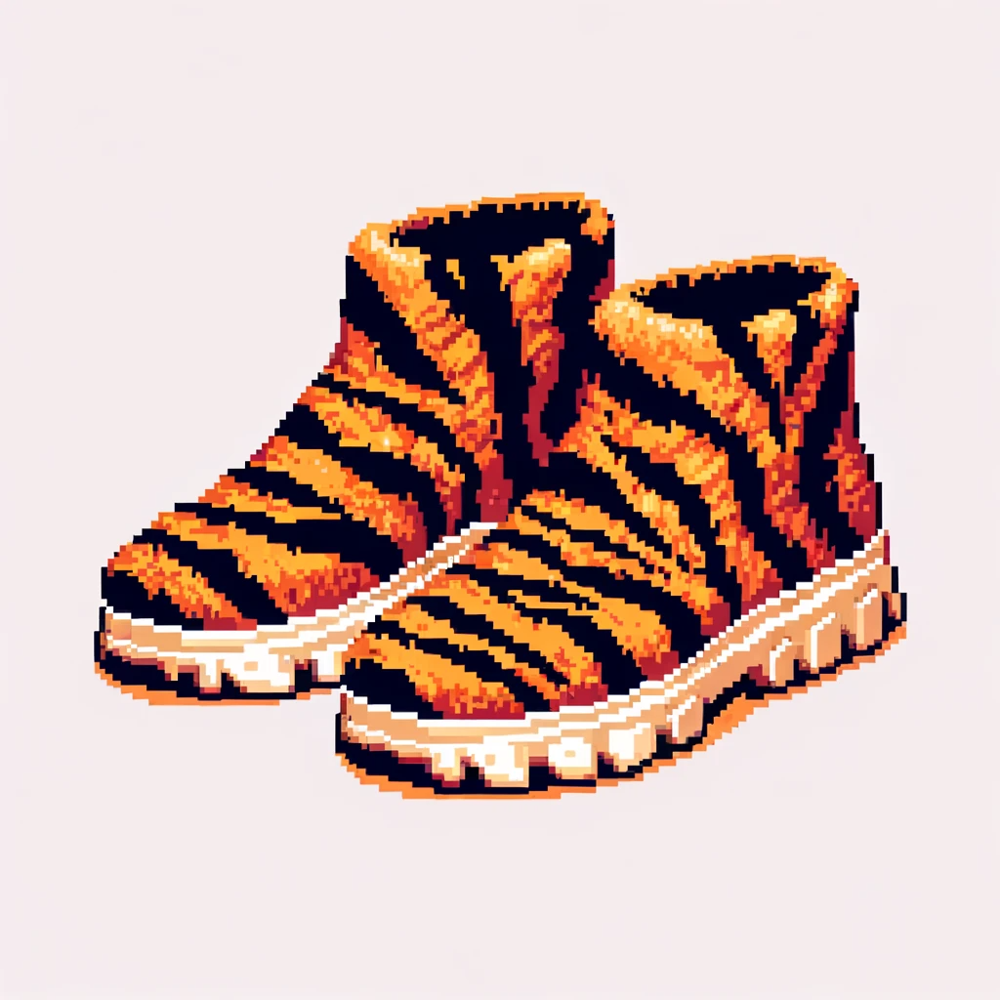
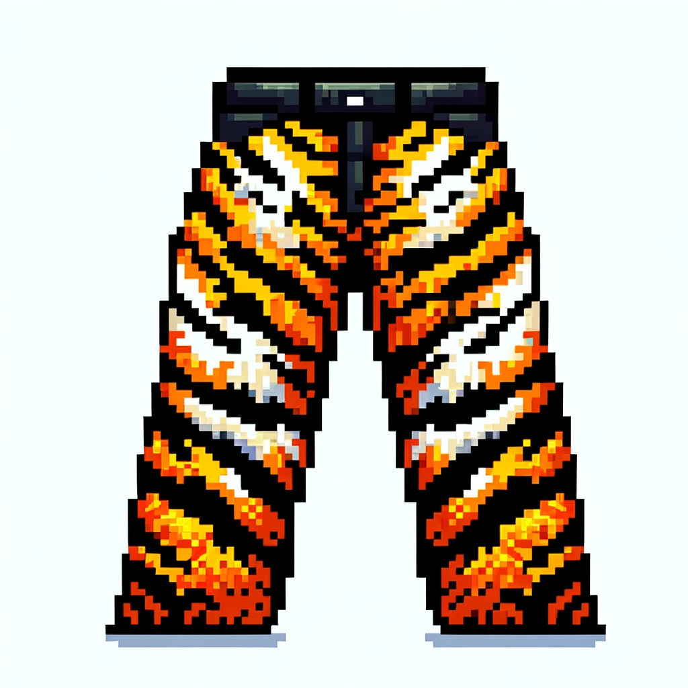
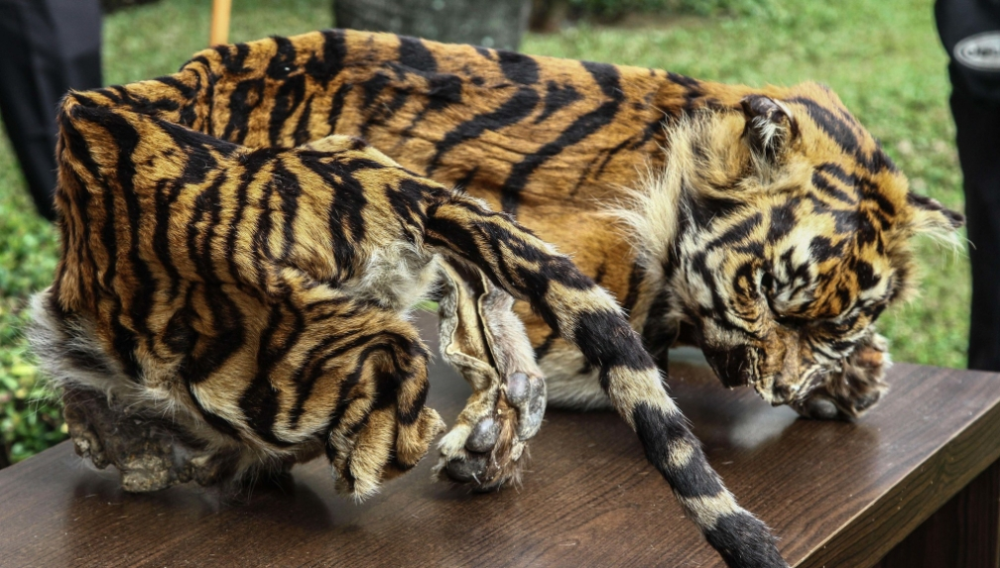

# Buy the products of Sumatran tigers

Here are some examples below:

<figure><figcaption>
A coat made from Sumatran tiger skin
</figcaption></figure>

<figure><figcaption>
A pair of shoes made from Sumatran tiger skin
</figcaption></figure>

<figure><figcaption>
A pants made from Sumatran tiger skin
</figcaption></figure>

These are some products made from the body of the Sumatran tigers, the number of the products player wear will have different effects on the amount of tokens they win.&#x20;

The more products the player wear, the more damage they do to the Sumatran tiger each time they hit it, and the amount of the tokens players receive depends on their damage.

These Sumatran tiger skin products we designed are not based on imagination, but are illegal trades happening in real life.

<figure><figcaption>
Sumatran tiger skins to be traded
</figcaption></figure>

Our game Trading Sumatran Tiger Skins simulates exactly this process in real life.
