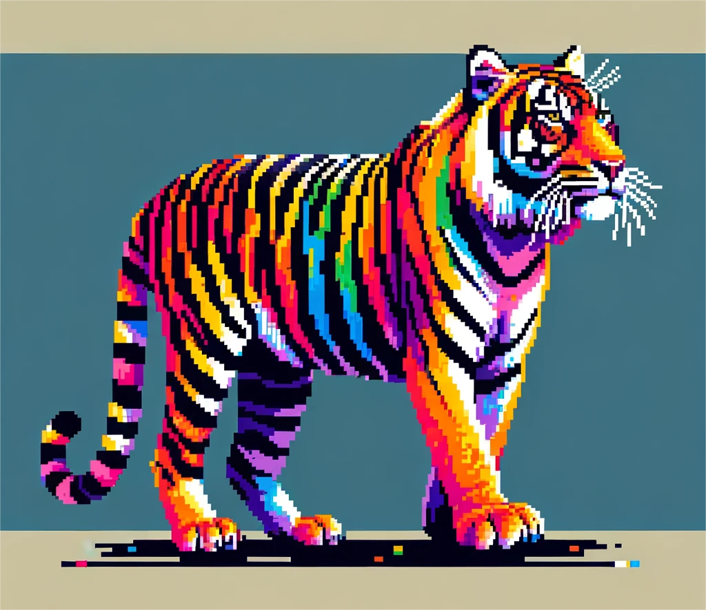

# You may become the tiger!

There is a limit of up to 5000 Sumatran tigers in the forest, and a specific percentage of Sumatran tigers are generated every minute.

When the number of Sumatran tigers in the forest is less than a certain value, every once in a while, **half of the players will randomly become additional Sumatran tigers!**

**The more tiger skin products players wear, the greater the probability for them to become the tigers.**

Players who become tigers will **lose a certain percentage of the tokens they acquired after being killed.**

<figure><figcaption>
A Leatherback sea turtle with products of Sumatran tigers
</figcaption></figure>

## Special NFT

Players can purchase some special NFTs so that the tigers they transform into have certain special abilities, such as short-term invisibility, damage reduction, shortened transformation duration, etc.

<figure><figcaption>
Special NFT
</figcaption></figure>

<figure><figcaption>
Another type of Special NFT
</figcaption></figure>

_“Once good and evil merge into one, the strife will become endless._                                                         &#x20;

&#x20;                                                                        _——\[UK] John Newman”_
