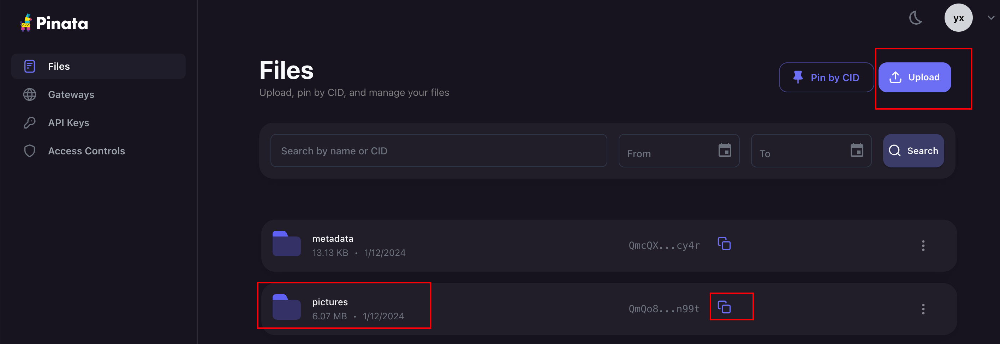

# Using Pinata for Metadata and Image Storage

## 1.**Upload Images**

Begin by uploading your digital art or NFT images to the 'pictures' folder within Pinata. This will ensure that your files are stored securely and are ready to be linked to your NFT metadata.

<figure><figcaption></figcaption></figure>

## **2.Verify Image URL**

Once uploaded, confirm that each image's URL is accessible through Pinata's cloud service. This URL is critical as it links your NFT to its visual representation.

<figure><figcaption></figcaption></figure>

## **3.Update Metadata**

Modify your NFT metadata to include the image URL from Pinata. This step is crucial for associating your NFT with the corresponding image.

<figure><figcaption></figcaption></figure>

## &#x20;**4.Upload Metadata**

After updating the metadata with the correct image URLs, upload the entire metadata folder to Pinata, ensuring that your NFT data is complete and accessible.
